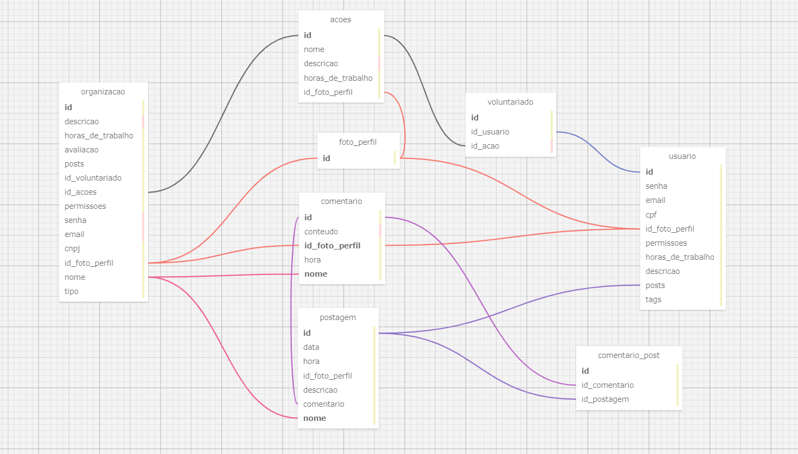

# MBD
Modelagem de Banco de Dados - Marcelo Rossignolli

---

# Modelo de Banco de Dados: Relacionamento 1:N e N:N

## Objetivo

O objetivo é aplicar rigorosamente os princípios de relacionamento 1:N (um para muitos), N:N (muitos para muitos) e as conexões entre chaves primárias e estrangeiras, respeitando as regras de negócio definidas pelo parceiro desde a primeira sprint.

## Descrição do Modelo

O modelo de banco de dados foi projetado para representar e gerenciar eficientemente as relações entre entidades. As tabelas principais incluem `organizacao`, `usuario`, `postagem`, e `comentario`. As tabelas auxiliares incluem `foto_perfil`, `tipo`, `voluntariado` e `comentario_post`.

 

 

### Tabelas Principais

#### Tabela `organizacao`

- **Campos**:
  - `id`: Identificador único da organização.
  - `descricao`: Descrição da organização.
  - `horas_de_trabalho`: Número de horas de trabalho.
  - `avaliacao`: Avaliação da organização.
  - `posts`: Relacionamento com a tabela `postagem`.
  - `id_voluntariado`: Relacionamento com a tabela `voluntariado`.
  - `id_acoes`: Relacionamento com a tabela `acoes`.
  - `permissoes`: Permissões associadas à organização.
  - `senha`: Senha da organização.
  - `email`: Email da organização.
  - `cnpj`: CNPJ da organização.
  - `id_foto_perfil`: Relacionamento com a tabela `foto_perfil`.
  - `nome`: Nome da organização.
  - `tipo`: Relacionamento com a tabela `tipo`.

#### Tabela `usuario`

- **Campos**:
  - `id`: Identificador único do usuário.
  - `senha`: Senha do usuário.
  - `email`: Email do usuário.
  - `cpf`: CPF do usuário.
  - `id_foto_perfil`: Relacionamento com a tabela `foto_perfil`.
  - `permissoes`: Permissões associadas ao usuário.
  - `horas_de_trabalho`: Número de horas de trabalho do usuário.
  - `descricao`: Descrição do usuário.
  - `posts`: Relacionamento com a tabela `postagem`.
  - `tags`: Tags associadas ao usuário.

#### Tabela `postagem`

- **Campos**:
  - `id`: Identificador único da postagem.
  - `data`: Data da postagem.
  - `hora`: Hora da postagem.
  - `id_foto_perfil`: Relacionamento com a tabela `foto_perfil`.
  - `descricao`: Descrição da postagem.
  - `comentario`: Relacionamento com a tabela `comentario_post`.
  - `nome`: Nome da postagem.

#### Tabela `comentario`

- **Campos**:
  - `id`: Identificador único do comentário.
  - `conteudo`: Conteúdo do comentário.
  - `id_foto_perfil`: Relacionamento com a tabela `foto_perfil`.
  - `hora`: Hora do comentário.
  - `nome`: Nome do comentário.

### Tabelas Auxiliares

#### Tabela `foto_perfil`

- **Campos**:
  - `id`: Identificador único da foto de perfil.

#### Tabela `tipo`

- **Campos**:
  - `id`: Identificador único do tipo.
  - `empresa`: Nome da empresa.
  - `ong`: Nome da ONG.

#### Tabela `voluntariado`

- **Campos**:
  - `id`: Identificador único do voluntariado.
  - `id_usuario`: Relacionamento com a tabela `usuario`.
  - `id_acao`: Relacionamento com a tabela `acoes`.

#### Tabela `comentario_post`

- **Campos**:
  - `id_comentario`: Relacionamento com a tabela `comentario`.
  - `id_postagem`: Relacionamento com a tabela `postagem`.

### Relações N:N

#### acoes-usuario

- **Entidades Envolvidas**: `acoes` e `usuario`
- **Relacionamento**: Um usuário pode realizar várias ações e uma ação pode pertencer a vários usuários.
- **Tipo de Relacionamento**: N:N usando uma tabela intermediária (`voluntariado`).

#### permissoes-usuario

- **Entidades Envolvidas**: `permissoes` e `usuario`
- **Relacionamento**: Um usuário pode ter várias permissões e uma permissão pode pertencer a vários usuários.
- **Tipo de Relacionamento**: N:N.

## Análise de Negócios

A Tabela foi criada com o intuito de armazenar os dados necessários para a elaboração do projeto "VTM", em parceria com a ONG Parceiros Voluntários, que visa a idealização de um "Market Place" reunindo diversos trabalhos voluntários por todo o país, vacilitando assim a prática da atividade.